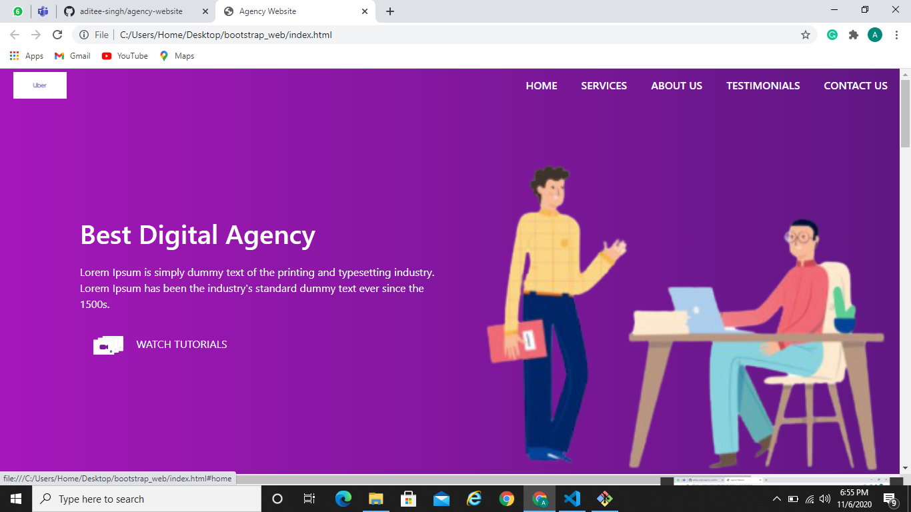

## Business Website
Designed a business website from scratch using HTML, CSS, Bootstrap, JavaScript.

## Webview 

## Implementation

- This is a template for a business website.

- It consists of a home page which is divided into various sections.

- The homepage is divided into a display, services, about-us, testimonials, contact us and footer section.

- The footer section includes a form. 

- Smooth-scroll functionality added using JavaScript.

## Instructions

- Just open the index.html file.

## Technologies Used

- HTML
- CSS
- Bootstrap
- JavaScript